# AI-Native Architecture: Hub-and-Spoke Model

**Status:** Proposed
**Date:** 2026-01-02
**Author:** Architecture Review

---

## Overview

This document proposes an evolution from the current linear/phase-based multi-agent workflow to an **AI-Native Hub-and-Spoke Architecture** with a central "Truth Source." This model better reflects how AI agents can operate in parallel with shared state, rather than following strict sequential handoffs.

---

## The Proposed Architecture


---

## Detailed Architecture Diagram


---

## Component Breakdown

### 1. User Layer
- **Intent**: Natural language requirements, feature requests
- **Approval**: Human-in-the-loop decision points (gates)

### 2. Orchestration Hub
| Component | Responsibility |
|-----------|----------------|
| **Orchestrator** | Central coordinator, decides which workers to activate |
| **Task Queue** | Prioritized work items waiting for execution |
| **Agent Router** | Routes tasks to appropriate workers based on capabilities |

### 3. The Truth (Central State)

The key innovation: a **single source of truth** that all agents read from and write to.

| Store | Contents | Purpose |
|-------|----------|---------|
| **State Store** | STATUS.md, MEMORY.md, state.json | Track progress, learnings, current phase |
| **Specifications** | OpenAPI, Prisma, Zod, PRD | Define what to build (machine-readable) |
| **File System** | src/, tests/, docs/ | The actual codebase |

### 4. Worker Swarm

Workers operate in **parallel** when possible, not sequentially:

| Category | Workers | Function |
|----------|---------|----------|
| **Planning** | Product Manager, Architect | Write specifications |
| **Generation** | Full Stack Generator, UI Generator, API Generator | Generate code from specs |
| **Validation** | Auto-Reviewer, Security Scanner, QA Validator | Validate and gate progress |

---

## Data Flow

```mermaid
sequenceDiagram
    participant U as User
    participant O as Orchestrator
    participant T as Truth (State)
    participant S as Specs
    participant W as Workers
    participant R as Reviewers

    U->>O: "Build a todo app with auth"
    O->>T: Initialize project state
    O->>W: Activate PM + Architect

    par Parallel Spec Writing
        W->>S: PM writes PRD
        W->>S: PM writes OpenAPI stub
        W->>S: Architect refines OpenAPI
        W->>S: Architect writes Prisma schema
    end

    O->>T: Check specs complete
    T-->>O: Ready for generation

    O->>W: Activate Code Generator
    W->>T: Read specs
    W->>T: Write src/ files

    T-->>R: File changes detected

    par Parallel Validation
        R->>T: Lint check → Pass
        R->>T: Type check → Pass
        R->>T: Test run → Pass
        R->>T: Security scan → Pass
    end

    T-->>O: All validations passed
    O->>U: Ready for review
    U->>O: Approved
    O->>T: Mark phase complete
```



---

## Comparison: Current vs AI-Native

| Aspect | Current (Linear) | AI-Native (Hub-Spoke) |
|--------|------------------|----------------------|
| **Execution** | Sequential phases | Parallel workers |
| **Handoffs** | Explicit agent-to-agent | Implicit via shared state |
| **State** | Scattered across docs | Centralized "Truth" |
| **Specs** | Human-readable docs | Machine-readable (OpenAPI/Prisma/Zod) |
| **Validation** | Phase gates | Continuous auto-review |
| **Blocking** | Wait for previous phase | Work on available tasks |
| **Recovery** | Re-run phase | Re-generate from specs |

### Current Architecture (Linear)

```
Intake → Planning → Architecture → Design → Development → Testing → Security → Deploy
   │         │           │           │            │            │          │        │
   ▼         ▼           ▼           ▼            ▼            ▼          ▼        ▼
  G1        G2          G3          G4           G5           G6         G7       G8
```

### AI-Native Architecture (Hub-Spoke)

```
                    ┌─────────────┐
                    │    User     │
                    └──────┬──────┘
                           │
                    ┌──────▼──────┐
          ┌────────►│ Orchestrator│◄────────┐
          │         └──────┬──────┘         │
          │                │                │
    ┌─────┴─────┐   ┌──────▼──────┐   ┌─────┴─────┐
    │  Workers  │◄──│   TRUTH     │──►│ Reviewers │
    │  (Swarm)  │──►│(State+Specs)│◄──│  (Gates)  │
    └───────────┘   └─────────────┘   └───────────┘
```

---

## Implementation Considerations

### Phase 1: Truth Layer
1. Define `state.json` schema for project state
2. Adopt OpenAPI 3.1 for API specifications
3. Use Prisma schema as database truth
4. Use Zod schemas shared between frontend/backend

### Phase 2: Worker Simplification
1. Consolidate 14 agents into functional categories:
   - **Planners**: PM + Architect → write specs
   - **Generators**: Dev agents → generate from specs
   - **Validators**: QA + Security → validate output
2. Workers become stateless, reading/writing only to Truth

### Phase 3: Continuous Validation
1. File watchers trigger auto-review on changes
2. Parallel linting, type-checking, testing, security scans
3. Results feed back to state for orchestrator decisions

### Phase 4: Self-Healing Loop
1. Failed validations trigger targeted regeneration
2. Specs are immutable source; code is regenerable
3. Memory captures patterns for improvement

---

## Benefits

| Benefit | Description |
|---------|-------------|
| **Parallelism** | Workers can execute simultaneously |
| **Idempotency** | Regenerate code anytime from specs |
| **Transparency** | Single source of truth for debugging |
| **Recovery** | Failed state → re-run from last good specs |
| **Efficiency** | No waiting for sequential handoffs |
| **Scalability** | Add workers without changing architecture |

---

## Risks & Mitigations

| Risk | Mitigation |
|------|------------|
| Spec conflicts from parallel writes | Orchestrator locks sections during writes |
| Complex state management | Use event sourcing for state changes |
| Loss of human oversight | Maintain approval gates at key decisions |
| Over-automation | Keep user in control of "what", AI handles "how" |

---

## Next Steps

1. [ ] Review and approve this architecture proposal
2. [ ] Design `state.json` and `specs.json` schemas
3. [ ] Prototype Truth layer with current STATUS.md
4. [ ] Test parallel worker execution
5. [ ] Implement continuous validation pipeline

---

## Related Documents

- [WORKFLOWS.md](WORKFLOWS.md) - Current workflow definitions
- [ARCHITECTURE.md](ARCHITECTURE.md) - Current architecture template
- [constants/protocols/PROTOCOLS.md](../constants/protocols/PROTOCOLS.md) - Agent communication protocols

---

*This is a proposed architecture for discussion and future implementation.*
